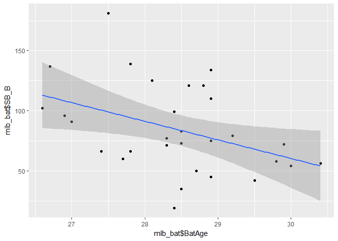
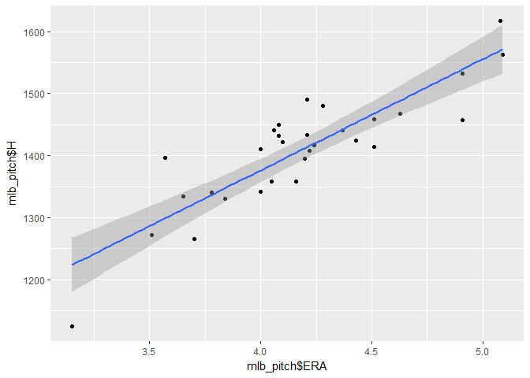
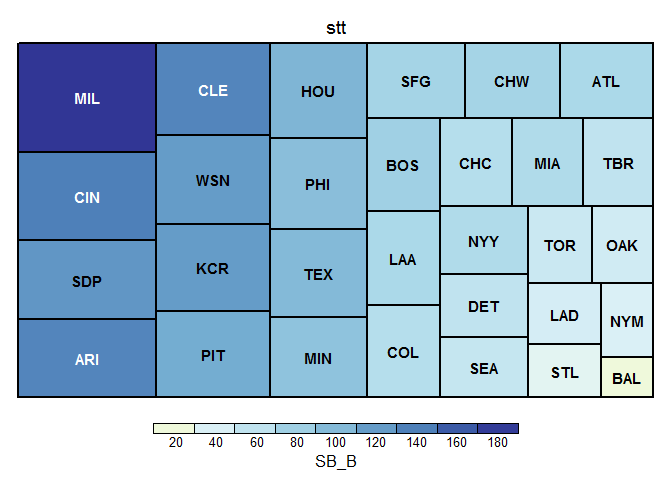

美國職棒大聯盟
================
組員: B0444220 鍾家祺 , B0444225 黃筱茜

**分析議題**
------------

------------------------------------------------------------------------

美國職棒大聯盟(MLB)是全世界最高的棒球殿堂，創立於1903年，在台灣成績較優秀的選手通常都會被MLB的球團賞識。MLB總共有30支隊伍，有29支來自美國各地，有1支來自加拿大，並且分為美聯以及國聯，隊伍名稱有奪冠最多次的紐約洋基、邁阿密馬林魚、波士頓紅襪、和2016年冠軍隊芝加哥小熊等等。目前旅美的台灣選手陳偉殷效力於邁阿密馬林魚隊擔任投手，並且是第4號先發，是我們台灣之光。

**動機**
--------

------------------------------------------------------------------------

我們組員本身就對棒球有相當大的興趣，因此對於MLB也有一些了解，所以想要藉此機會來分析MLB各個隊伍的成績，也讓大家知道美國球類運動是多麼盛行。

**格式**
--------

------------------------------------------------------------------------

兩個資料都為excel檔

``` r
library(readxl)
```

    ## Warning: package 'readxl' was built under R version 3.3.3

``` r
mlb_bat <- read_excel("C:/Users/Yuan/Downloads/mlb_bat.xlsx") 
mlb_pitch <- read_excel("C:/Users/Yuan/Downloads/mlb_pitch.xlsx")  
```

**假設**
--------

------------------------------------------------------------------------

1.  隊上平均年齡越長，盜壘數越少
2.  投手ERA越低，被安打數越少
3.  盜壘次數越多，成功次數越多

**圖表**
--------

------------------------------------------------------------------------

| Tm  |  wingames|
|:----|---------:|
| CHC |        45|
| TEX |        28|
| WSN |        28|
| CLE |        27|
| BOS |        24|
| LAD |        20|
| BAL |        16|
| TOR |        16|
| NYM |        12|
| SFG |        12|

    ## Warning: package 'ggplot2' was built under R version 3.3.3






    ## Warning: package 'treemap' was built under R version 3.3.3



**結果**
--------

------------------------------------------------------------------------

假設1：因為盜壘考量的因素有很多，像是***腳程***或是***起跑時機***等等之類的因素，所以跟年紀並沒有絕對的關係。

假設2：當投手ERA越低，代表越能壓制打擊者。

假設3：這個假設證明了多嘗試，成功的機會也會增加。

**資料介紹&來源**
-----------------

------------------------------------------------------------------------

-   2016年美國職棒聯盟每隊投手各項目平均成績
-   2016年美國職棒聯盟每隊的打擊手各項目平均成績
-   [BASEBALL REFERENCE的2016 MLB Team Statistics](http://www.baseball-reference.com/leagues/MLB/2016.shtml#teams_standard_batting)

**組員工作分配**
----------------

------------------------------------------------------------------------

-   鍾家祺：coding, 構想, PPT
-   黃筱茜：報告, 構想
